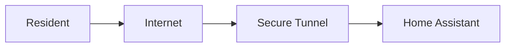
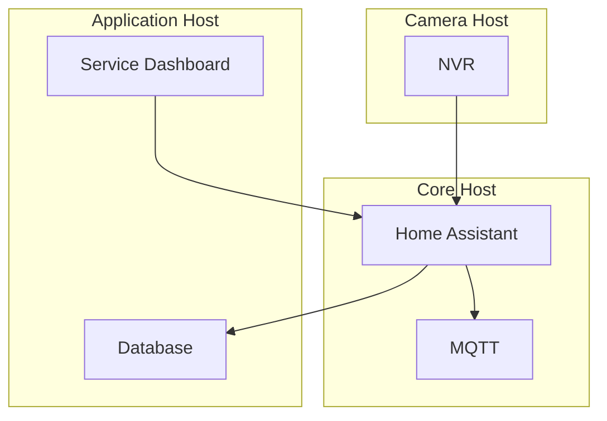
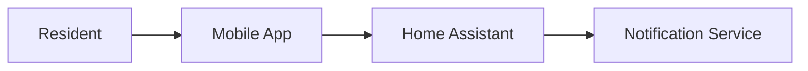

# Excalidraw Mermaid Playbook

Use this reference when you need a stable, reviewable architecture diagram artifact.

## Goal

Produce Mermaid that:

- is easy to diff in Git;
- is readable in Markdown or issue comments;
- imports into Excalidraw without heavy cleanup.

## Recommended views

### Context diagram

Use when the audience only needs major boundaries.

### Deployment diagram

Use when the audience needs host and service placement.

### Flow diagram

Use when the audience cares about one path rather than the full estate.

## Label rules

- Prefer stable role-based hostnames over raw private IP addresses.
- Prefer user-facing product names over internal implementation nouns unless the audience needs those details.
- Keep labels human-readable; IDs belong in notes, not node titles.

## Edge rules

- Use unlabeled arrows for obvious traffic or relationships.
- Add short labels only when they change understanding, such as `RTSP`, `MQTT`, `HTTPS`, or `Webhook`.
- Include port numbers only when they are architecturally meaningful.

## Split rules

Split into multiple diagrams when any of these are true:

- more than four hosts;
- more than 15 nodes;
- mixed audiences, such as operators and application users;
- both runtime placement and request flow are important.

A useful split is public edge and user entry points in one diagram, then host/container placement in another.

## Excalidraw guardrails

Avoid these Mermaid features in Excalidraw-bound artifacts:

- non-flowchart diagram types;
- expanded shape syntax (`@{ ... }`);
- CSS classes or class attachments;
- inline style directives;
- HTML inside labels;
- click handlers.

Apply visual polish after importing into Excalidraw.

## File naming

Prefer short, obvious filenames:

- `docs/diagrams/home-assistant-context.mmd`
- `docs/diagrams/host-topology.mmd`
- `docs/diagrams/public-edge-flow.mmd`

## Review checklist

- Does the diagram answer one question clearly?
- Are host or trust boundaries obvious?
- Are public entry points distinguishable from LAN-only services?
- Is the artifact readable as raw Mermaid text?
- Will Excalidraw import it without advanced Mermaid features?
